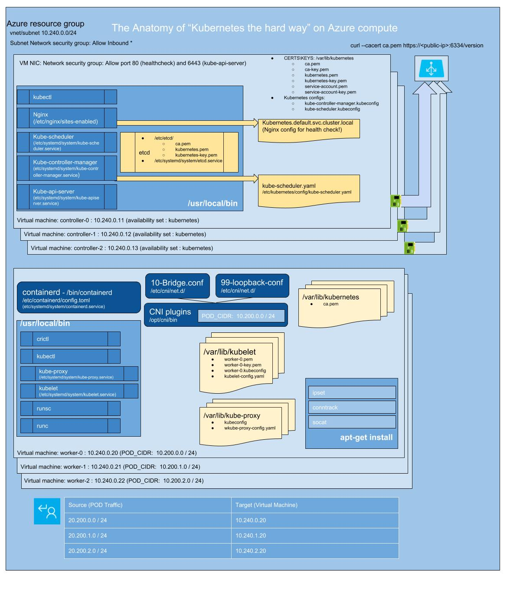

# K8s Hard Mode on Azure

This readme lists out steps I followed for creating a practise Kubernetes cluster on Azure compute.

The guide I followed is Kelsey Hightower's "Kubernetes the hard way"
It can be found [here](https://github.com/kelseyhightower/kubernetes-the-hard-way)

Disclaimers:
This is not a conversion or a re-implementation of it. It's not even really a guide.
This is simply a summary of what I went through, to create a Kubernetes cluster on Azure compute. I scripted up all the components for `az` Azure CLI as I was learning how to bootstrap a K8s control plane and worker nodes on bare Azure virtual machines.
This is not production ready. 
This is not all 100% secure.
This is not AKS or ACS-Engine equivalent.

If you require more info on every step below, be sure to check out Kelsey's guide as mentioned above.

I've created a brain dump image of all the components

 </br>

## Prerequisites

* Azure Account with sufficient credit
* Azure subscription access
* CFSSL and CFSSLJSON as per Kelsey's guide
* Azure CLI

You can use my [kube-tools](https://github.com/marcel-dempers/kube-tools) which has all the prerequisites to bootstrap Kubernetes

## Create temporary folder to generate everything

```
mkdir _output
```
## Generate SSH keys

To access your cluster controller and workers VMs you will need to generate SSH key

```
./sshkeys.sh
```

## Create network

```m
./network.sh
```

## Create the compute resources
```
./compute.sh
```

make sure VMs are all up, You can ssh to them to test

```
az vm list -g $RESOURCEGROUP -o table --show-details
#grab public ip of a vm
```

```
ssh azureuser@<ip> -i id_rsa
```

## Generate all certs and key pairs
```
./generate-01-ca-cert.sh
./generate-02-admin-client-cert.sh
./generate-03-api-client-certs.sh
./generate-04-kube-controller-manager-client-certs.sh
./generate-05-kube-proxy-client-certs.sh
./generate-06-kubelet-client-certs.sh
./generate-07-scheduler-client-certs.sh

```
## Copy certificates to controllers and workers:

```
./copy-keys-certs-to-controller.sh
./copy-keys-certs-to-worker.sh
```
## Generate kubernetes configs for all components
```

./kubeconfigs-01-nodes.sh
./kubeconfigs-02-admin.sh
./kubeconfigs-03-kube-controller-manager.sh
./kubeconfigs-04-kube-proxy.sh
./kubeconfigs-05-kube-scheduler.sh

```

## Copy kubeconfigs to controllers and workers

```
./copy-kubeconfigs-to-controllers.sh
./copy-kubeconfigs-to-workers.sh
```

## Data encryption configs and key

Generate secret encryption key and upload to controllers

```
./encryption-key-config.sh
```
# ETCD

Firstly setup unique etcd configs for each controller

```
for instance in controller-0 controller-1 controller-2; do ./etcd-01-setup-configs.sh ${instance} ; done
```

## Copy bootstrap script to controllers

```
./etcd-copy-bootstrap-to-controllers.sh
```

## Bootstrap etc on each controller

```
RESOURCEGROUP=k8s-the-hard-way
EXTERNAL_IP=$(az vm list -g $RESOURCEGROUP --query="[?name=='controller-0']" -o json --show-details | jq .[0].publicIps | sed 's/\"//g')
ssh azureuser@$EXTERNAL_IP

./etcd-bootstrap.sh
```

Once this is done on all controllers, check health on one of them

```
sudo ETCDCTL_API=3 etcdctl member list \
--endpoints=https://127.0.0.1:2379 \
--cacert=/etc/etcd/ca.pem \
--cert=/etc/etcd/kubernetes.pem \
--key=/etc/etcd/kubernetes-key.pem
```

# Bootstrap Kubernetes 

## Generate and copy systemd files for kube api, scheduler, and controller manager

```
for instance in controller-0 controller-1 controller-2; do ./kubernetes-systemd-files.sh ${instance}; done
```

## Copy Kubernetes bootstrap scripts to each controller

```
./kubernetes-copy-bootstrap-to-controller.sh
```

## Setup API server, controller manager and scheduler on each controller server

```
EXTERNAL_IP=$(az vm list -g $RESOURCEGROUP --query="[?name=='controller-0']" -o json --show-details | jq .[0].publicIps | sed 's/\"//g')
ssh azureuser@$EXTERNAL_IP

./kubernetes-bootstrap.sh
./kubernetes-healthcheck.sh
./kubelet-rbac.sh
```

## Verification 

``` 
kubectl get componentstatuses --kubeconfig admin.kubeconfig
curl -H "Host: kubernetes.default.svc.cluster.local" -i http://127.0.0.1/healthz
```

## Create the API server load balancer

```
./load-balancer.sh
```

## Verification

you need to be able to run `curl` against every controller vm public ip as well as the load balancer ip.
if this does not work you need to ssh to the controller and make sure /healthz endpoint is exposed internally.
once its exposed internally you should ensure it can be exposed from the public IP as well.
If all else fails, follow load balancer troubleshooting guide [here](https://docs.microsoft.com/en-us/azure/load-balancer/load-balancer-troubleshoot)


```
RESOURCEGROUP=k8s-the-hard-way
KUBERNETES_PUBLIC_ADDRESS=$(az network public-ip show -n kubernetes-master -g $RESOURCEGROUP | jq .ipAddress | sed 's/\"//g')
curl --cacert ca.pem https://${KUBERNETES_PUBLIC_ADDRESS}:6443/version
```

# Bootstrap Kubernetes workers

Copy the bootstrap scripts to node

```
./worker-bootstrap-01-copy-to-worker.sh
```

ssh to each node and run the bootstrap installs like so:

```
CIDR_RANGE=0

./worker-bootstrap-02-installs.sh
./worker-bootstrap-03-cni.sh $CIDR_RANGE
./worker-bootstrap-04-containerd.sh
./worker-bootstrap-05-kubelet.sh $CIDR_RANGE                                                                                                
./worker-bootstrap-06-kubeproxy.sh                                                                                                          
./worker-bootstrap-07-start.sh

```

## Verification

SSH back to your controllers and test the node availability: `kubectl get nodes --kubeconfig admin.kubeconfig`
You should see your nodes in ready state

## Remote kubectl Access

```
./kubectl.adminconfig.sh

#copy file to your `~/.kube/
cp  ./_output/config ~/.kube/config
kubectl get nodes
kubectl get componentstatuses
```

# Pod Network Routing

Create UDRs to routes to join worker PODCIDR to node IPs

```
./workers-routetable-setup.sh
```

# Cluster DNS addon

```
./dns-addon.sh
```
